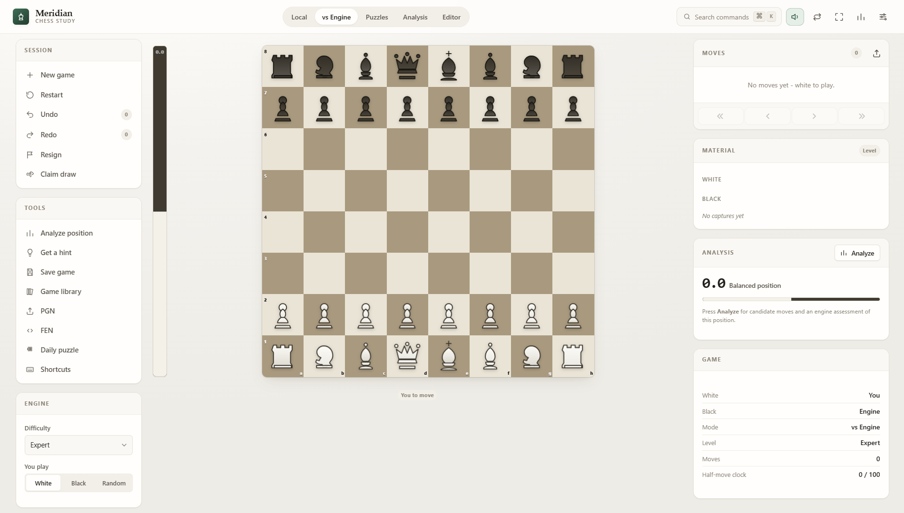

# ♟️ Meridian Chess

A refined, modern chess study board and engine built with pure vanilla web standards. Features real-time engine evaluation, tactical puzzles, game analysis, customizable themes, embedded SVG piece sets, procedural Web Audio sound effects, and full FEN/PGN support, with **zero external dependencies** and **zero build step**.

---

## 🌟 Live Demo

- **URL**: [https://meridian-chess.vercel.app](https://meridian-chess.vercel.app)

---

## ✨ Key Features

- **Game Modes**:
  - **Local Pass-and-Play**: Play with synchronized chess clocks and increment settings.
  - **Play vs AI Engine**: Challenge a built-in chess engine with configurable difficulty and evaluation.
  - **Tactical Puzzles**: Interactive puzzle trainer with blunder detection, hints, and streak tracking.
  - **Analysis Board**: Deep position analysis with candidate moves, threat detection, and live evaluation bar.
  - **Position Editor**: Set up custom board positions, place pieces freely, and import/export FEN strings.
- **Customization & Themes**:
  - **6 Themes**: Gentle Light, Midnight, Graphite, Warm Ivory, Emerald, and High Contrast.
  - **5 Vector Piece Sets**: Classic, Minimal, Modern, Outline, and Glass (crisp inline SVGs).
  - Responsive board layout optimized for desktop, tablet, and mobile.
- **Dynamic Web Audio**:
  - Real-time procedural audio synthesis using the Web Audio API for moves, captures, checks, castling, and low-time warnings.
- **PGN & FEN Support**:
  - Move history with standard algebraic notation (SAN), step-by-step move navigation, one-click PGN/FEN import & export, and local auto-save.
- **Command Palette & Keyboard Shortcuts**:
  - Quick actions accessible via <kbd>Ctrl</kbd>/<kbd>Cmd</kbd> + <kbd>K</kbd>, board flip (<kbd>F</kbd>), undo/redo, sound toggle (<kbd>S</kbd>), and fullscreen mode.

---

## 🛠️ Technologies

- **HTML5**: Semantic document structure & board container
- **CSS3**: Modern layouts, responsive styling, and CSS custom properties (variables) for theme switching
- **JavaScript (ES6+)**: Vanilla client-side game state, FIDE rule validation, AI engine, and PGN/FEN parser
- **Web Audio API**: Real-time procedural sound effects without external audio files
- **Inline SVG**: Scalable vector graphics for piece sets and UI iconography